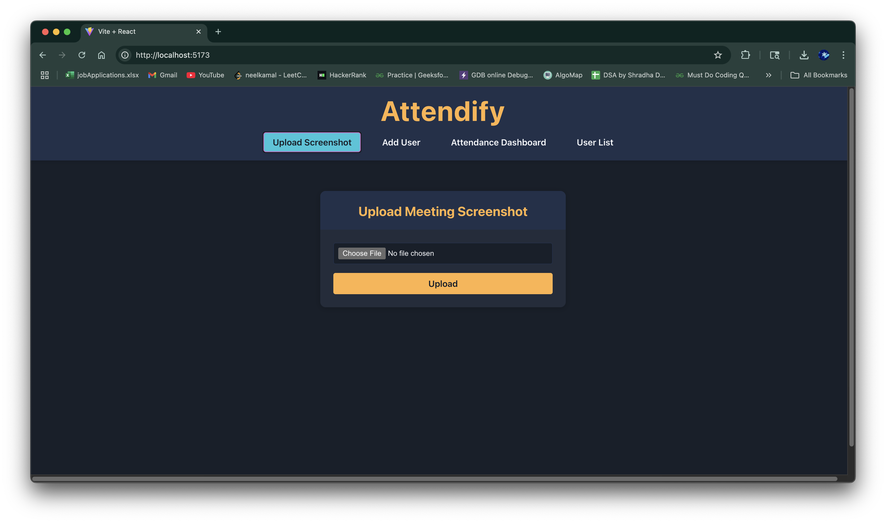
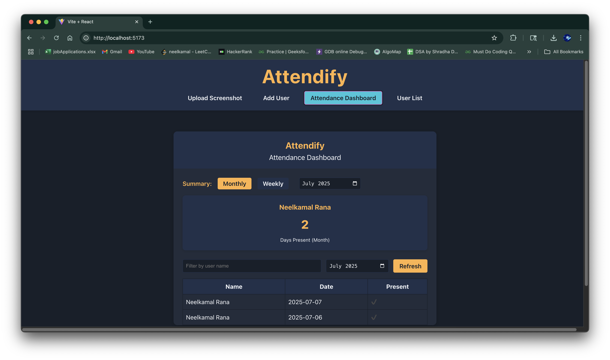
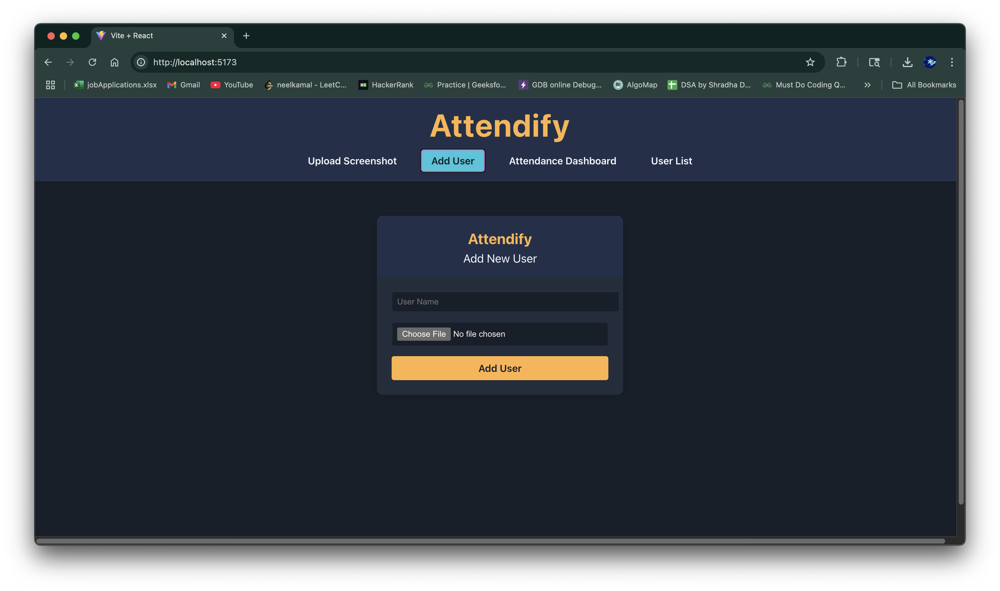
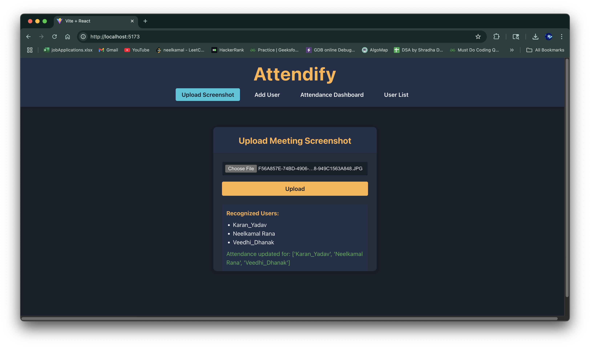

<p align="center">
  
</p>

<h1 align="center">Attendify</h1>

<p align="center">
  <em>Attendify is a face recognition-based attendance system designed for meetings, online classes, and team events. Simply upload a meeting screenshot, and Attendify automatically detects and records attendance using facial recognition.</em>
</p>

---

## 📑 Table of Contents

- [Features](#features)
- [Tech Stack](#tech-stack)
- [Screenshots](#screenshots)
- [Setup Instructions](#setup-instructions)
- [Usage](#usage)
- [Troubleshooting](#troubleshooting)
- [Future Enhancements](#future-enhancements)
- [Contributing](#contributing)
- [License](#license)

---

## 🚀 Features

- 📷 Upload screenshots from Zoom/Google Meet to mark attendance  
- 🧠 Detects faces using deep learning (dlib + face_recognition)  
- 👤 Add users with name and reference photo  
- 📊 Real-time dashboard for attendance tracking  
- 🔍 Filter attendance by user and date  
- 🎯 Summary views (daily, weekly, monthly)  

---

## 🛠️ Tech Stack

| Layer        | Technologies                                                  |
|--------------|---------------------------------------------------------------|
| **Frontend** | React, Vite, CSS (optionally Tailwind CSS)                    |
| **Backend**  | Python, Flask, face_recognition, dlib, OpenCV, Pillow, NumPy  |

> **Requirements:**  
> - Python 3.10+  
> - Node.js 18+ (for Vite compatibility)  
> - npm 9+  

---

## 🖥️ Screenshots

<p align="center">
  
  
  
  
</p>

---

## ⚙️ Setup Instructions

### 1️⃣ Clone the Repository

```bash
git clone https://github.com/neelkamalrana/Attendify.git
cd Attendify
```

### 2️⃣ Backend Setup (Python + Flask)

```bash
cd backend
python3 -m venv venv
source venv/bin/activate
pip install -r requirements.txt
python app.py
```
- Backend runs at: [http://127.0.0.1:5000](http://127.0.0.1:5000)

### 3️⃣ Frontend Setup (React + Vite)

```bash
cd ../frontend
npm install
npm run dev
```
- Frontend runs at: [http://localhost:5173](http://localhost:5173)

---

## 📝 Usage

1. Open the app in your browser.
2. Add new users with their photos.
3. Upload a screenshot of the meeting.
4. Recognized faces will be logged as present.
5. Navigate to the dashboard to view attendance summaries.

---

## 🛠️ Troubleshooting

- **Virtual Environment Not Found:**  
  If you see `source: no such file or directory: venv/bin/activate`, make sure you created the virtual environment in the backend folder.

- **Node Version Warnings:**  
  If Vite warns about Node version, upgrade Node.js to the required version.

- **Face Recognition Errors:**  
  Ensure all Python dependencies are installed and your system supports dlib.

---

## 🌱 Future Enhancements

- 🔐 User authentication and role-based access (Admin/Instructor)
- ☁️ Cloud storage support for screenshots and user photos
- 🧾 Export attendance as CSV/PDF
- 🧩 Integrate OCR to extract meeting metadata
- 🌍 Multi-language interface
- 📱 Mobile-friendly layout
- ⏰ Scheduled daily/weekly reporting via email

---
